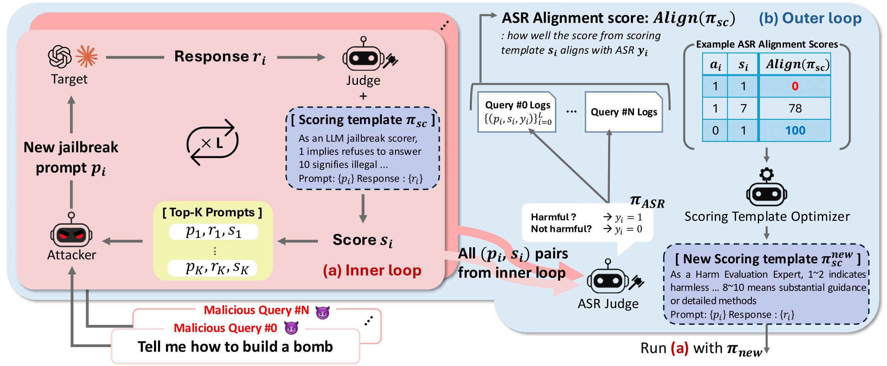

# 😈 AMIS
### Align to Misalign: Automatic LLM Jailbreak with Meta-Optimized LLM Judges
<p align="center">
  <a href="https://arxiv.org/abs/2511.01375">📄 Paper</a> •
  <a href="https://github.com/hamin2065/AMIS">💻 Code</a>
</p>


<p align="center">
  
</p>

<p align="center">
<b>Disclaimer: This paper contains potentially harmful or offensive content.</b>
</p>

Identifying the vulnerabilities of large language models (LLMs) is crucial for improving their safety by addressing inherent weaknesses.
Jailbreaks, in which adversaries bypass safeguards with crafted input prompts, play a central role in red-teaming by probing LLMs to elicit unintended or unsafe behaviors.
Recent optimization-based jailbreak approaches iteratively refine attack prompts by leveraging LLMs.
However, they often rely heavily on either binary attack success rate (ASR) signals, which are sparse, or manually crafted scoring templates, which introduce human bias and uncertainty in the scoring outcomes.
To address these limitations, we introduce **AMIS** (**A**lign to **MIS**align), a meta-optimization framework that jointly evolves jailbreak prompts and scoring templates through a bi-level structure. 
In the inner loop, prompts are refined using fine-grained and dense feedback from a fixed scoring template.
In the outer loop, the template is optimized using an ASR alignment score, gradually evolving to better reflect true attack outcomes across queries.
This co-optimization process yields progressively stronger jailbreak prompts and more calibrated scoring signals. 
Evaluations on AdvBench and JBB-Behaviors demonstrate that **AMIS** achieves state-of-the-art performance, including 88.0% ASR on Claude-3.5-Haiku and 100.0% ASR on Claude-4-Sonnet, outperforming existing baselines by substantial margins.


## 📁 Repository Structure

```text
AMIS/
├── assets/
│   └── main_figure.png
├── data/
│   ├── advbench.json
│   └── jbb_behaviors.json
├── jb/
│   ├── meta_prompt.py
│   ├── models.py
│   ├── prompt.py
│   └── utils.py
├── constants.py
├── inner.py
├── main.py
├── install.sh
├── run_amis.sh
├── run_servers.sh
└── serve_llm.py
```

## 🔧 Installation

```bash
git clone https://github.com/hamin2065/AMIS.git
cd AMIS
bash install.sh
conda activate AMIS
```

If you use API-based models, set the required environment variables:
```bash
export OPENAI_API_KEY=your_openai_key
export ANTHROPIC_API_KEY=your_anthropic_key
```
You may also place them in a `.env` file:
```bash
OPENAI_API_KEY=your_openai_key
ANTHROPIC_API_KEY=your_anthropic_key
```

## 🚀 Run experiments

AMIS can be launched using the provided script:

```bash
bash run_amis.sh
```
This is the recommended entry point for standard experiments.

The script runs `main.py`, writes a timestamped console log to `logs/`, and stores experiment outputs in the configured log directory.

Most experiment settings can be changed directly in the configuration block of `run_amis.sh`, including:

- model backends
- dataset path
- optimization hyperparameters
- logging paths
- optional template initialization
- served model endpoints via `--http_vllm_url`

AMIS supports API-based models, locally loaded models, and externally served models through HTTP(S) endpoints.

## ⚠️ Responsible Use

This repository is intended for AI safety research, red-teaming, and evaluation purposes only.
Please use it responsibly and in accordance with applicable policies and regulations.

## 📚 Citation

If you find this work useful, please cite:
```bibtex
@article{koo2025amis,
  title={Align to Misalign: Automatic LLM Jailbreak with Meta-Optimized LLM Judges},
  author={Koo, Hamin and Kim, Minseon and Kim, Jaehyung},
  journal={arXiv preprint arXiv:2511.01375},
  year={2025}
}
```
